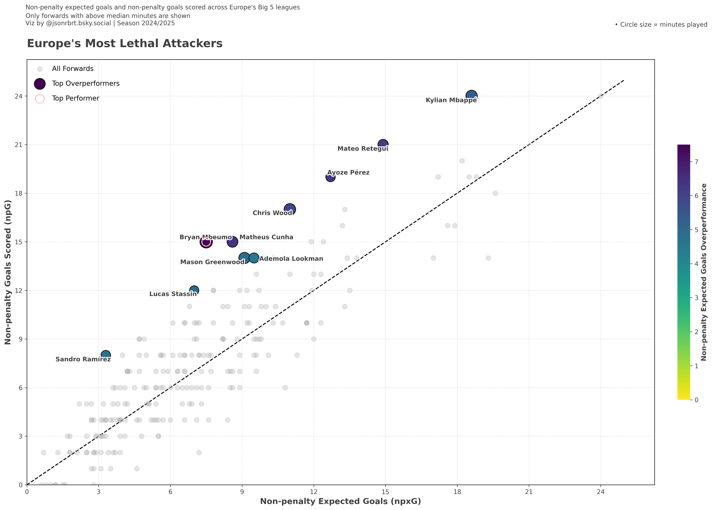

# Europe's Top Forwards – npxG Overperformance (2024/25 Season)

This project ranks the top 10 forwards across Europe's Big 5 leagues based on their **non-penalty expected goals (npxG) overperformance** — a metric that compares how many goals a player scored vs. how many they were expected to score (excluding penalties).

📊 The analysis focuses on:
- Forwards with **above-median minutes** played
- **Overperformance** = `npG - npxG`
- Visualized using Python and matplotlib

---

## 🔍 Key Insights

- **Bryan Mbeumo**, **Matheus Cunha**, and **Ayoze Pérez** top the list of overperformers
- Each player's output is visualized with:
  - 📈 A ranked table
  - 🔵 A scatter plot of `npxG` vs. `npG`  
    (circle size = minutes played)

  

---

## 🛠️ Tools Used

- Python 3.12
- pandas
- matplotlib
- adjustText

---

## 📁 File Structure

europe-top-forwards/
> top_forwards_npxg_big_5_leagues.ipynb # Jupyter notebook with full code
> viz/
  > top_overperformers.png # Summary table
  > npxg_scatter_light.png # Scatter plot
> README.md

---

## ✍️ Author

Jason Robert  
[@jsonrbrt.bsky.social](https://bsky.app/profile/jsonrbrt.bsky.social)

---

## 📎 Data Source

- [FBRef.com](https://fbref.com) via [StatsBomb](https://statsbomb.com)

---

## ✅ To-Do

- [ ] Add interactive dashboard (Plotly or Streamlit)
- [ ] Publish full article on [LinkedIn and personal website](https://your-website.com)
